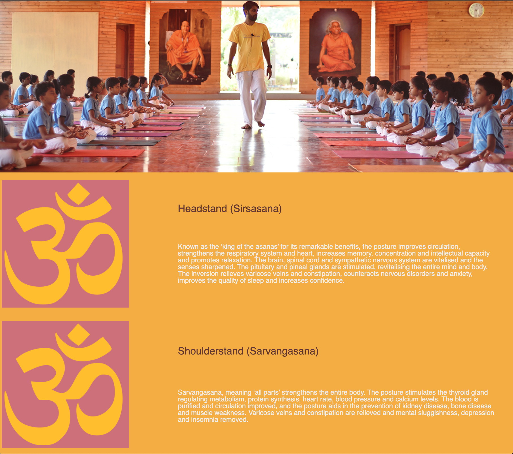

# Purpose
This Website contains the framework for a future Yoga Web Application.  It illustrates using Cascading Stylesheets (CSS)Commit for functionality, eventually adding Javascript.

## Current Functionality
While viewing in the browser of your choice, best viewed in Chrome or Brave Desktop, mouseover the individual cards to see the associated picture of the asana.

## Product Roadmap
1. Javascript Card Flipping
2. Voiceover
3. Pranayama Timing App
